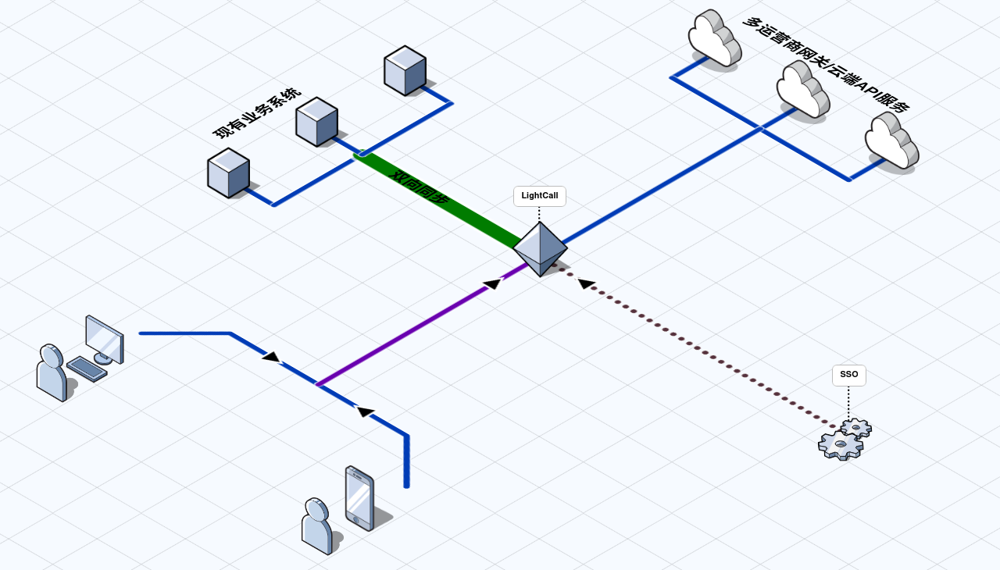

    
     
    
    

LightCall 旨在提供一个简单、高效且易于维护的外呼解决方案，适合小型团队、需要与内部系统集成的场景。

*(目前还没有正式release, still working on it)*

## 项目简介

LightCall 提供了一个完整的呼叫中心解决方案，包括：

- 🎯 三层业务管理结构: 目标(顶层业务事件) - 任务(目标客户,负责人) - 活动(电话外呼、备注、跟进记录)
- 🔄 其他系统数据集成: 实现双向同步
- 🌐 多SIP网关接入(线路运营商)
- 📱 外呼号码管理
- ☁️ 云端服务集成: 在呼叫各阶段集成云端API能力(黑名单, 闪信等)
- 🐳 本地化Docker镜像部署
- 🌐 支持多种网络架构: 通过内网或公网访问并使用
- 📱💻 支持多端: 手机通过浏览器可以使用本服务(浏览器需支持WebRTC)

适宜场景: 客户回访, 客服售后, 精准客户营销等事件驱动的外呼。不适宜也不提倡会对用户造成骚扰的高频呼叫。

未来 Roadmap 规划:
- [ ] 📊 呼叫策略: 选择合适的外呼号码提升接通率
- [ ] 📈 接通率分析: 分析通话情况并提出优化措施
- [ ] 🔐 单点登陆集成
- [ ] 🚫 本地黑名单: 避免对特定号码进行外呼, 造成打扰
- [ ] 🤖 AI能力集成: 录音识别、通话质检等

## 运行方式

- 本地部署Demo: [demo](example/demo)
- 生产环境通过内网访问(TODO)
- 生产环境通过外网访问(TODO)

## 核心业务流程

## 对比其他方案

1. 对比 `SIP客户端`
   - 优势: 可以汇集业务流程进行管理; 支持多运营商网关, 根据策略自动路由。

2. 对比 `传统呼叫中心`
   - 优势: 本地化部署; 没有复杂的功能, 只专注外呼使用更便捷; 有双向同步机制, 集成业务系统更方便。

3. 对比 `CRM集成的呼叫功能`
   - 优势: 专注于外呼, 外呼相关能力更完善; CRM之外的系统也能集成。

| 特性             | LightCall | SIP客户端   | 传统呼叫中心     | CRM集成呼叫 |
| ------           | --------  | ----------- | --------------   | ---------   |
| 开源             | ✅        |             | ❌               | ✅          |
| 功能简单         | ✅        | ✅          | ❌               | ❌          |
| 本地化部署       | ✅        | ✅          | 大部分是SaaS系统 | ✅          |
| 多网关           | ✅        | ❌          | ✅               | ✅          |
| 集中管理         | ✅        | ❌          | ✅               | ✅          |
| 集成CRM系统      | 容易      | 难          | 较难             | 容易        |
| 集成非CRM系统    | 容易      | 难          | 较难             | 较难        |
| 云端通话能力接入 | ✅        | ❌          | ✅               | ❌          |

## 用到的开源项目

本项目的落地离不开以下开源项目的支持, 十分感谢:
- [PocketBase](https://github.com/pocketbase/pocketbase)
- [Vue3](https://github.com/vuejs/core)/[Primevue](https://github.com/primefaces/primevue)/[Tailwindcss](https://github.com/tailwindlabs/tailwindcss)
- [FreeSWITCH](https://github.com/signalwire/freeswitch)/[JsSIP](https://github.com/versatica/JsSIP)
